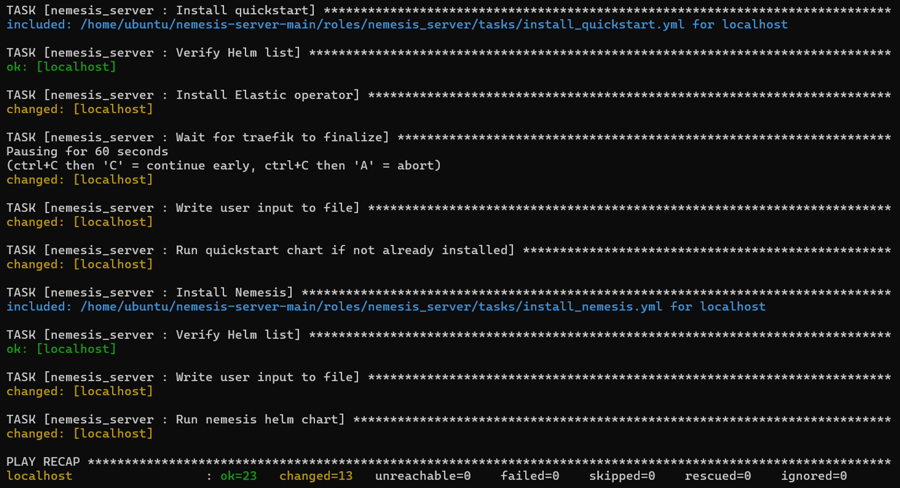

# nemesis-server-main

Ansible role solution to deploy (https://github.com/SpecterOps/Nemesis).

# Installation

```bash
git clone https://github.com/YiikerGiiker/Nemesis-Ansible.git
sudo apt install ansible
```

# Help

To ensure smooth deployment, variables present in the defaults folder should be modified to fit the users requirements. The nemesis_server_username should be set to the username of the user present on the remote server (example: ubuntu) while the nemesis_server_password should be set to the password used to authenticate to Nemesis.

Default deployment is executed on the localhost and can take up to 30 minutes!!, an inventory file with IP addresses can be used to execute the playbook on a remote machine.

# Execution example

```bash
cd nemesis-server-main
sudo ansible-playbook nemesis_server.yml
```



